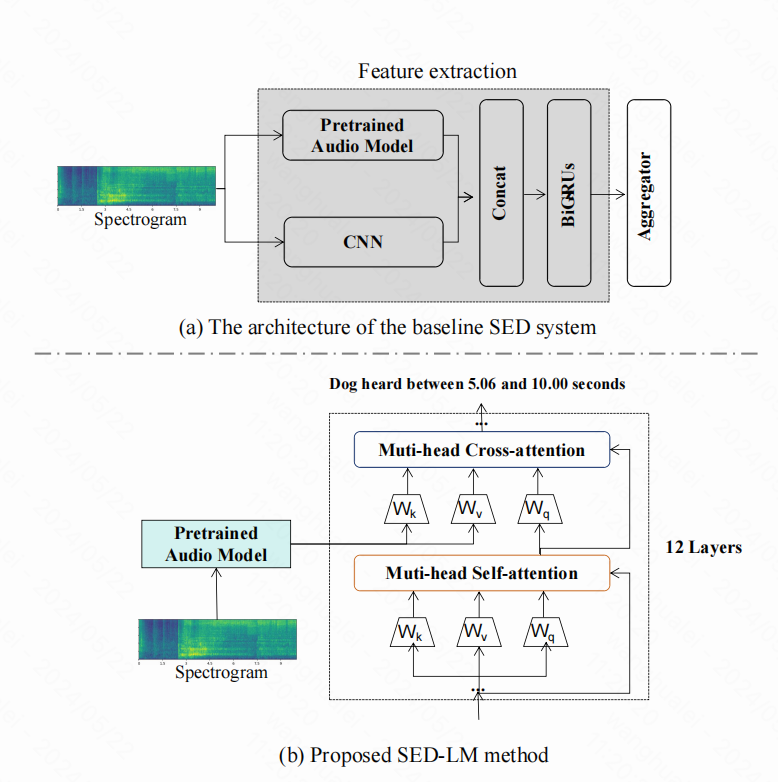

## Leveraging Language Model Capabilities for Sound Event Detection
we propose an end-to-end framework for understanding audio features while simultaneously generating sound event and their temporal location.
##💡 Introduction
• We propose an end-to-end method to generate SED content in multi-modal, which is flexiblely adapted to different audio feature extractor component and the pretrained language generator.
• Our method combines the strengths of pretrained language models with audio models, achieving multi-modal integration through cross-attention mechanism. Language model generates text corresponding to relevant audio segments with precise occurrence of sound event.
##🚀 Method

