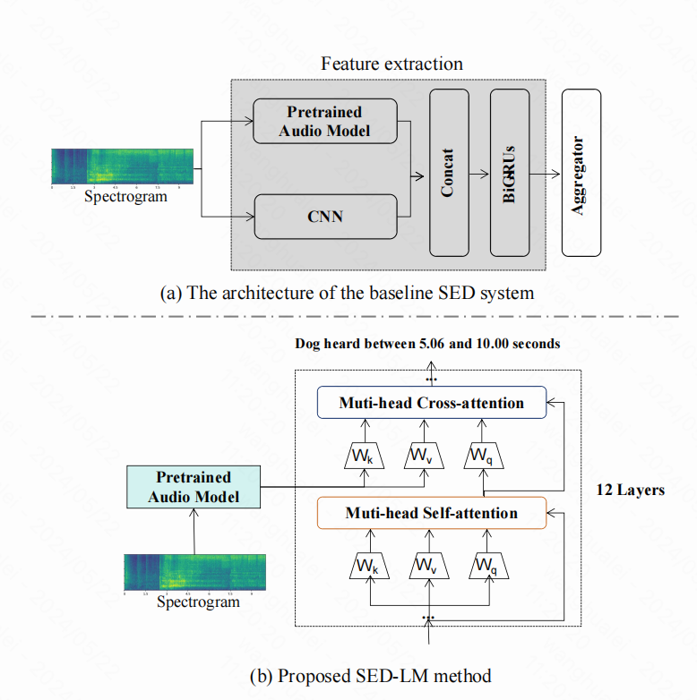

## Leveraging Language Model Capabilities for Sound Event Detection
SED-LM framework utilizes the language model to flexibly understand abundant semantic context aligned with the acoustic representation.
## 💡Introduction
We propose an end-to-end method to generate SED content in multi-modal, which is flexiblely adapted to different audio feature extractor component and the pretrained language generator.
Our method combines the strengths of pretrained language models with audio models, achieving multi-modal integration through cross-attention mechanism. Language model generates text corresponding to relevant audio segments with precise occurrence of sound event.

## 🚀Method

The DCASE2023 baseline SED systems and language model for automatic SED. (a) shows baseline SED system. (b) is the architecture of SED-LM. The module in the dashed block is a transformer layer with cross-attention.

## Data
Perpare [SED data](https://github.com/turpaultn/dcase20_task4) and transform them to audio-text josn file.
## Download pretrained audio encoders
Please download pretrained audio encoders from [ATST](https://github.com/Audio-WestlakeU/ATST-SED) or [HTSAT](https://github.com/RetroCirce/HTS-Audio-Transformer) or [BEATs](https://github.com/microsoft/unilm/blob/master/beats/BEATs.py)

Put them under `./pretrained_models/audio_encoders`.
## Train
`python train.py`
## Inference
`python test.py`
## Thanks
[Wavcaps](https://github.com/XinhaoMei/WavCaps/tree/master/captioning)
[BEATs](https://github.com/microsoft/unilm/blob/master/beats/BEATs.py)
[ATST](https://github.com/Audio-WestlakeU/ATST-SED)
